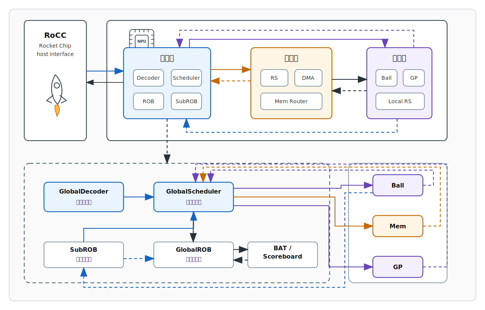
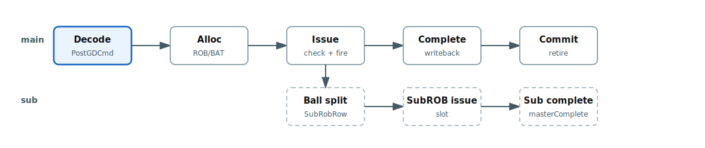
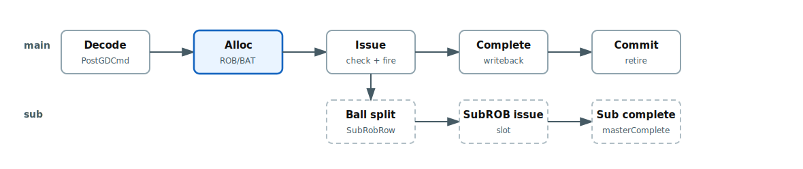
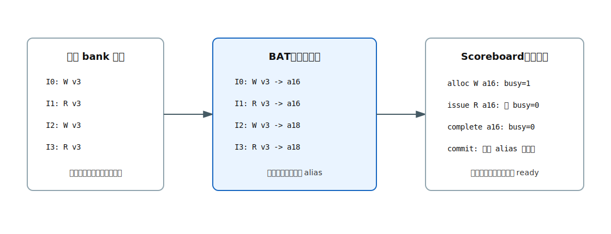
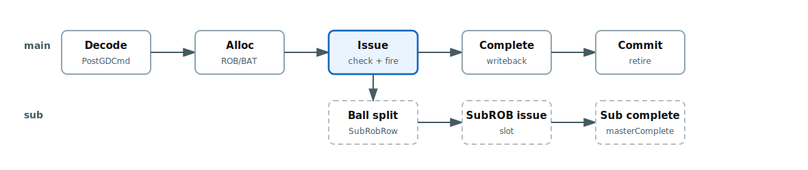
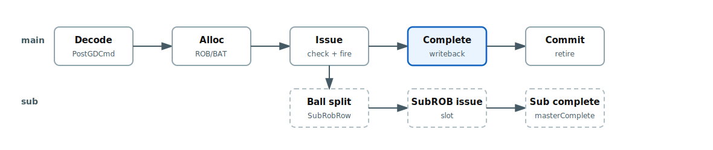
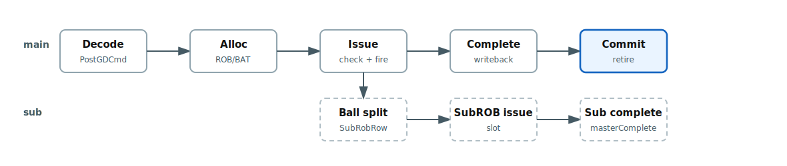
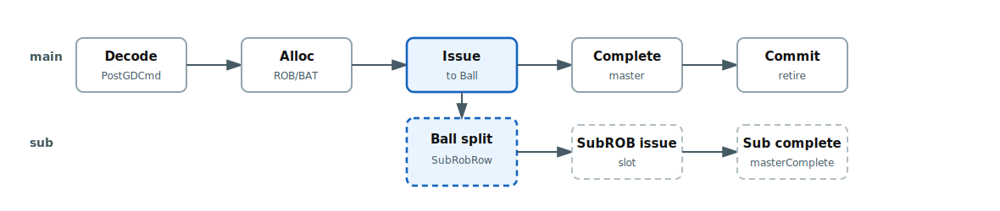
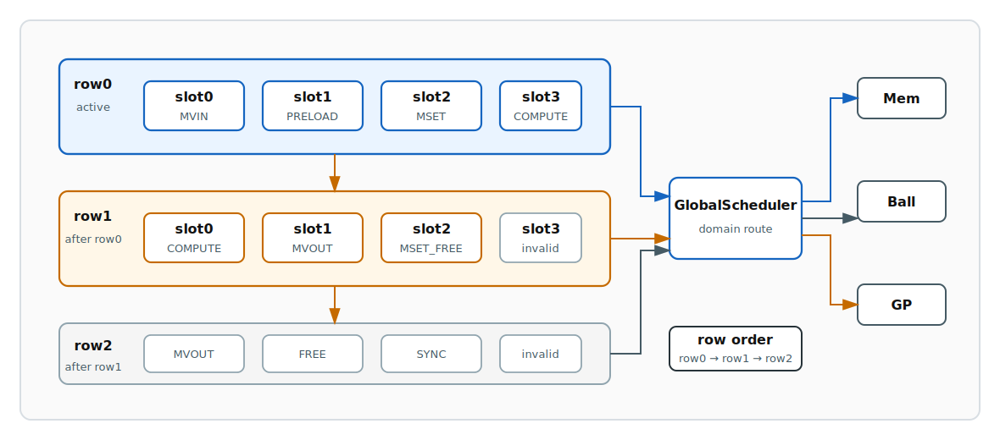
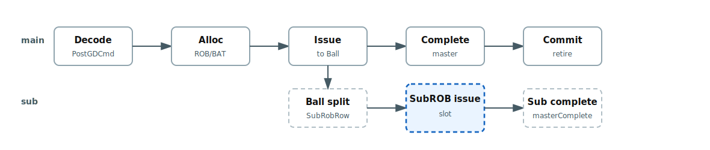

# BB 前端域架构

## 1 导言

前文提到，BB 的 RTL 架构分为前端域、内存域和架构域。在微架构视角中，处理器里负责指令供给的部分叫做前端（Frontend），BB 的 Frontend 通过BAT、Scoreboard等机制实现了强大的乱序发射和顺序回收，保证了NPU的指令并行（ILP）。此外 BB 提供了多样化的参数设置，以满足不同场景下的指令吞吐需求，Frontend 的模块划分如下：

- `GlobalDecoder` 把 RoCC 指令翻译成 BB 前端统一认识的 `PostGDCmd`。
- `GlobalScheduler` 决定指令能不能进入 ROB，能不能发射到某个执行域。
- `GlobalROB` 保存全局顺序，让指令可以乱序执行，但最后仍然顺序提交。
- `BankAliasTable` 负责给写 bank 做重命名，避免假相关把调度卡死。
- `BankScoreboard` 负责盯住真正的数据相关，防止读到还没写完的数据。
- `SubROB` 负责微指令。复杂 Ball 可以把一条主指令拆成一串小指令，再交回前端统一调度。

下图展示了Frontend在全局中的位置，以及Frontend内部的模块互联，当前的NPU指令设计与RocketChip CPU强耦合。



本文档的核心目标是从数据流的角度向读者们解释，NPU在接受了CPU传来的指令后，指令将如何被解码，分配进栈，如何排队，如何被挑中发射，如何回来报到，最后如何从 ROB 中退休。


## 2 指令预处理

### 2.1 指令解码



前端域接受 CPU 传来的指令 `RoCCCommandBB`。这份指令还带着 RoCC 的格式痕迹，不能直接进入全局调度：调度器并不关心一条指令在软件侧如何编码，它首先需要知道这条指令属于哪个执行域、访问哪些 bank、是否会改变前端控制流。而 `GlobalDecoder` 的作用就是把 `RoCCCommandBB` 指令整理成 `PostGDCmd`，这个过程中主要涉及以下三方面的转译：

- 指令归属：通过 `domain_id` 区分 FRONTEND、MEM、GP、BALL。
- 数据访问：通过 `BankAccessInfo` 描述最多两个读 bank 和一个写 bank。
- 前端控制：通过 `isFence` 和 `isBarrier` 标识不进入 ROB 的控制指令。


解码后的 `PostGDCmd` 是前端后续所有模块共同理解的指令形态，其中 bank 信息类似于 CPU 指令中的 REG 信息，bank 的访问信息来自 `funct7[6:4]` 和 `rs1Data`。前者说明“访问形态”，后者说明“bank id 从哪里取”：

<table>
<tr>
<td valign="top">

| `funct7[6:4]` | bank 访问形态 |
| --- | --- |
| `000` | 不访问 bank |
| `001` | 读 `bank_0` |
| `010` | 写 bank |
| `011` | 读 `bank_0`，写 bank |
| `100` | 读 `bank_0`、`bank_1`，写 bank |

</td>
<td valign="top">

| `rs1Data` 字段 | 含义 |
| --- | --- |
| `rs1[9:0]` | `bank_0` |
| `rs1[19:10]` | `bank_1` |
| `rs1[29:20]` | `bank_2` |
| `rs1[63:30]` | `iter` |

</td>
</tr>
</table>

这里需要注意一个编码差异：Mem 指令的写 bank 来自 `bank_0`，Ball 指令的写 bank 来自 `bank_2`。这个差异在 Decoder 内部被抹平，后级模块只看到统一的 `BankAccessInfo`。

此外，`GlobalDecoder` 不额外缓存指令，它的输入 ready 跟随输出 ready。后级无法接收时，RoCC 入口会被反压。这样做让 Decoder 保持为一个轻量的预处理边界，真正的排队和乱序能力交给后面的 GlobalROB。

## 3 指令调度

### 3.1 指令入栈



ROB（Re-Order Buffer，重排序缓存）是前端的核心组件，解码后的普通指令会进入 `GlobalScheduler`，再由 Scheduler 分配进 `GlobalROB`。为了后续的乱序发射准备，这里的“入栈”不是简单写入一个 FIFO，而是同时建立三种状态：ROB 顺序、bank 版本、依赖占用。

前端控制指令不会进入 ROB。`FENCE` 会置起 `fenceActive`，等待 ROB 清空；`BARRIER` 会先等待 ROB 清空，再拉高 `barrier_arrive`，直到外部 `barrier_release` 返回。这两类指令的语义是控制前端边界，而不是参与乱序执行。

除了刚刚提到的两个指令，普通指令入 ROB 时，`tailPtr` 就是它的 `rob_id`。一个 ROB 项保存：

| 字段 | 作用 |
| --- | --- |
| `cmd` | Decoder 输出的 `PostGDCmd` |
| `renamedBankAccess` | BAT 重命名后的 bank 访问 |
| `rob_id` | 该项在 GlobalROB 中的位置 |

真正值得关注的是 BAT 和 Scoreboard 的配合。BAT 解决“同名 bank 的版本问题”，Scoreboard 解决“这个版本现在能不能读”的问题，两者配合工作可以消除指令之间的假相关依赖。



BAT 的重命名核心可以压成三件事：读者查旧版本，写者拿新版本，最后发布新版本。

```scala
private val aliasBase = vbankUpper + 1
private def extraAlias(robId: UInt): UInt =
  aliasBase.U(aliasIdLen.W) + robId

val q = io.alloc.raw

// 1. 读 bank：查 v2a，拿到当前版本
io.alloc_renamed.rd_bank_0_id := mapVbank(q.rd_bank_0_id)
io.alloc_renamed.rd_bank_1_id := mapVbank(q.rd_bank_1_id)

// 2. 写 bank：按 rob_id 分配新版本
io.alloc_renamed.wr_bank_id   := extraAlias(io.alloc.rob_id)

// 3. alloc 成功：发布新版本
when(io.alloc.valid && q.wr_bank_valid) {
  v2a(toVbankIdx(q.wr_bank_id)) := extraAlias(io.alloc.rob_id)
}
```

第一件事是读者查旧版本：`mapVbank` 查 `v2a`，把原始虚拟 bank 翻译成当前 alias。第二件事是写者拿新版本：写 bank 不复用原始 bank id，而是分配 `extraAlias(rob_id)`。第三件事是发布新版本：alloc 成功后，BAT 把 `v2a(wr_vbank)` 更新成这个新 alias。这里的写重命名公式是 `new_alias = aliasBase + rob_id`，其中 `aliasBase = vbankUpper + 1`。也就是说，虚拟 bank 编号只用来索引 `v2a`，决定“哪一个虚拟 bank 的当前版本被改写”；真正分配出来的新 alias 只由 ROB 位置决定。

如果没有 BAT，所有写同一个虚拟 bank 的指令都会互相卡住，因为调度器只能看到“都叫 vbank3”。BAT 引入 alias 后，每一次写 bank 都会生成一个属于该 ROB 项的新版本，后续读者会读到当时最新的 alias。例如：

| 指令 | 原始访问 | BAT 后的访问 | 说明 |
| --- | --- | --- | --- |
| I0 | 写 vbank3 | 写 alias16 | vbank3 的新版本 |
| I1 | 读 vbank3 | 读 alias16 | 读 I0 产生的版本 |
| I2 | 写 vbank3 | 写 alias18 | vbank3 再产生新版本 |
| I3 | 读 vbank3 | 读 alias18 | 读 I2 产生的版本 |

这样一来，前端不再用“bank 名字”判断相关性，而是用“数据版本”判断相关性。这个变化使乱序发射有了空间。

Scoreboard 是 renamed alias 上的状态表，它不再关心原始 vbank 名字，而是关心“这个具体版本现在能不能被读”。每个 alias 主要维护两类状态：`bankWrBusy` 表示该 alias 的写者还没有完成，读到它的指令必须等待；`bankRdCount` 记录已经发射但还没完成的读者数量，用来描述当前 alias 上还有多少读操作在路上。发射检查时，RTL 实际只检查读端 RAW：`rd_bank_0` 或 `rd_bank_1` 命中 `bankWrBusy`，这条指令就不能发射。写端的 WAW/WAR 不再由 Scoreboard 阻塞，因为 BAT 已经给每一次写分配了独立 alias，写者不会和其他写者抢同一个名字，也不会覆盖老读者手里的旧版本。

Scoreboard 在 alloc 阶段就把写 alias 标记为 busy。这个时机非常关键：BAT 在 alloc 时已经把新 alias 发布给后续指令，如果 Scoreboard 不立刻标记 busy，后续读者可能在写者真正发射前就读到一个尚未产生的版本。等指令完成时，Scoreboard 再清掉写 busy，并把该指令曾经占用的读计数扣回去。

因此，入栈阶段完成的不是一个动作，而是一组同步更新：ROB 记录指令顺序，BAT 建立 bank 版本，Scoreboard 记录新版本尚未 ready。

### 3.2 指令发射



GlobalROB 允许乱序发射，但乱序不是随便发。每个周期，ROB 从 `headPtr` 开始扫描，选择第一条满足条件的指令：

```text
valid && !issued && !complete && !scoreboard_hazard && !cfg_hazard
```

Scoreboard 检查的是 renamed bank 上的真实 RAW 依赖。读 alias 时，如果该 alias 的写者还没有完成，读者不能发射；多个读者读同一个 ready alias 是允许的。WAW 和 WAR 这类名字相关已经被 BAT 的写 alias 机制消掉，因此 Scoreboard 不需要按原始虚拟 bank 再做保守阻塞。

除了普通数据依赖，ROB 还会检查配置类 hazard。`MSET` 和 `MMIO_SET` 会改变 bank 映射或 MMIO 绑定，因此当年轻指令和更老的配置相关指令访问重叠时，即使 Scoreboard 上没有数据 RAW，也不能随便越过。

发射时，ROB 会补齐 `op1_col`、`op2_col`、`wr_col`。这些列信息来自已经提交的 `MSET`，保存在 `bankCols` 中。Decoder 阶段只负责识别 bank id，真正发射时才把 bank 内部 column 一并带给执行域。

Scheduler 根据 `domain_id` 把 `GlobalSchedIssue` 送到 Ball、Mem、GP 三个出口。若 SubROB 当前有可发射的微指令，主 ROB 的发射会暂停，优先让微指令路径使用出口。这一点保证复杂指令拆分后的内部序列不会被主路径不断插队。

下面用一个小指令流说明乱序发射如何发生。假设 ROB 中已有 4 条指令，`I0` 尚未 ready，`I1`、`I2` ready，`I3` 依赖 `I2`：

| 周期 | ROB 状态 | Scoreboard 判断 | 发射结果 | 说明 |
| --- | --- | --- | --- | --- |
| T0 | I0、I1、I2、I3 valid | I0 等待 alias10；I1/I2 ready；I3 等 alias12 | 发射 I1 | 扫描跳过 I0，选择最早 ready 项 |
| T1 | I0 等待；I2 ready；I3 等待 | I2 ready | 发射 I2 | I2 虽年轻于 I0，但无依赖，可以越过 |
| T2 | I2 complete | alias12 释放 | 发射 I3 | I3 等到真实版本 ready 后发射 |
| T3 | I0 ready | alias10 释放 | 发射 I0 | 老指令最终补发，但提交仍受顺序约束 |

这里的“乱序”只发生在发射和完成阶段，提交仍然由 ROB 头部控制。

### 3.3 指令回收



执行域完成后，会从 Ball、Mem、GP 三个完成入口返回 `GlobalSchedComplete`。Scheduler 通过仲裁器把三路完成合成一条完成流，再根据 `is_sub` 决定写回主 ROB 还是写回 SubROB。

普通指令的完成包携带 `rob_id`。GlobalROB 收到后会把对应项标记为 complete，并通知 Scoreboard 释放该项占用的读计数和写 busy。默认配置 `rs_out_of_order_response = true`，因此完成可以乱序回来；只要 `rob_id` 对应的项已发射，就可以被标记为 complete。

如果 `rs_out_of_order_response` 关闭，Scheduler 会额外要求完成项必须是 `head_ptr`，从而把回收也约束为顺序回收。这个模式更保守，但牺牲了一部分执行域返回的自由度。

微指令完成不直接写主 ROB。执行域返回 `is_sub=true` 和 `sub_rob_id`，SubROB 用 `sub_rob_id = row_id * 4 + slot_id` 定位当前 row 中的 slot，标记该 slot done。只有当前 row 的所有 valid slot 都 done 后，SubROB 才推进到下一行。所有 row 完成后，SubROB 通过 `masterComplete(masterRobId)` 回写主 ROB。

### 3.4 指令提交



完成不等于提交。完成表示执行域已经返回，提交表示从全局顺序看这条指令可以退休。GlobalROB 的提交始终从 `headPtr` 开始，连续提交已经 complete 的项，遇到第一个未完成项就停止。

提交阶段会完成四件事：

1. 清除 ROB 项的 valid、issued、complete 状态。
2. 通知 BAT 释放对应 ROB alias 的元数据。
3. 若提交的是 `MSET`，更新 `bankCols`。
4. 推进 `headPtr`。

BAT 释放 alias 时不会无条件恢复旧映射。只有当当前虚拟 bank 的映射仍然指向该 ROB 项的新 alias 时，才恢复旧 alias。这样可以避免较老写指令提交时覆盖掉较年轻写指令已经建立的新版本。

因此，GlobalROB 的生命周期可以总结为：入栈建立顺序和版本，发射允许越过未 ready 的老项，完成释放依赖资源，提交恢复全局顺序并回收元数据。

## 4 微指令处理

### 4.1 指令拆分



普通指令是一条 `PostGDCmd` 对应一个主 ROB 项。微指令则是复杂 Ball 在执行主指令时生成的一组内部操作。它们仍然使用 `PostGDCmd` 格式，主指令被发射到 Ball 后在 Ball 内部被拆分成多个微指令，然后通过 `ball_subrob_req_i` 回灌到前端 SubROB。SubROB 的任务是把 Ball 生成的 row 转换成逐 slot 发射的微指令流。它不是另一个 GlobalROB 或者 GlobalROB 下的子模块，而是一个独立服务于单个主指令展开序列的微指令窗口。

拆分机制解决的是复杂指令的表达问题。一条高层 loop 指令可能包含配置、搬入、预加载、计算、搬出、释放等多个步骤。如果这些步骤全部暴露给软件，软件指令流会变得细碎；如果全部塞进一个 Ball 内部，前端又无法统一调度跨域操作。SubROB 提供了折中：软件仍发主指令，Ball 内部展开微指令并回灌到前端，前端继续用统一协议发射这些微指令。

SubROB 接收的基本单位是 `SubRobRow`，每行有 4 个发射槽。row 内描述可并行推进的微指令，row 间描述必须遵守的顺序边界，通过这种方式对有依赖的指令进行排序，没有依赖的指令并行执行，非常类似于CPU中的四发射乱序。



在上图的结构中，每个 slot 包含 `valid` 和 `cmd: PostGDCmd`。row 级别携带 `ball_id` 和 `master_rob_id`。`ball_id` 用于锁定当前 SubROB 服务的 Ball，`master_rob_id` 用于在所有微指令完成后回写主 ROB。

### 4.2 微指令调度


前文提到SubROB是一个四发射槽的多行序列，行内乱序，行间顺序。而SubROB的指令读入、发射、回收、退休则通过一个复杂的状态机来实现，本节的核心是解释这个状态机的跳转逻辑和状态输出。

SubROB 写入时有锁定规则：当 SubROB 为空时，可以接受任意 Ball 的第一行 row，并记录 `lockedBallId` 和 `masterRobId`；当 SubROB 已占用时，只接受同一个 Ball、同一个 `masterRobId` 的后续 row。这个规则避免多个复杂指令的微指令在同一个 SubROB 活动窗口内交错。


```text
SubROB 的状态机

               rowCount > 0
  +--------+ --------------> +----------+   SRAM read req   +-----------+
  | sIdle  |                 | sReadReq | ---------------> | sReadWait |
  +--------+ <-------------- +----------+                  +-----------+
      ^       masterComplete fire                                |
      |                                                          | data valid
      |                                                          v
  +-------------+     all rows done      +-----------+   issue valid slots
  | sWaitMaster | <--------------------- | sWaitSlots| <----------------+
  +-------------+                        +-----------+                  |
        ^                                      ^                        |
        | all slots done                       | wait subComplete        |
        +--------------------------------------+                        |
                                       current row all slots issued     |
                                                                         v
                                                                    +-----------+
                                                                    | sReadResp |
                                                                    +-----------+
```

状态机可以按两个阶段理解。第一阶段是取 row：`sReadReq` 向 SyncReadMem 发读请求，`sReadWait` 等同步读返回。第二阶段是处理 row：`sReadResp` 每周期选择当前 row 中第一个未发射的 valid slot 发射；所有 valid slot 发射后进入 `sWaitSlots` 等完成；所有 row 都完成后进入 `sWaitMaster`，向主 ROB 发出 `masterComplete`。

微指令发射时，SubROB 生成 `GlobalSchedIssue`。Scheduler 只看微指令自己的 `domain_id`，继续把它发往 Ball、Mem 或 GP。执行域只需要把 `is_sub` 和 `sub_rob_id` 原样带回完成包。

下面用一组 row 说明 4-slot 调度过程：

| 周期 | 当前 row | slot 状态 | SubROB 动作 | 返回/推进 |
| --- | --- | --- | --- | --- |
| T0 | row0 | s0/s1/s2/s3 valid | 发射 s0 | 等 s0 complete |
| T1 | row0 | s1/s2/s3 未发射 | 发射 s1 | s0 可乱序返回 |
| T2 | row0 | s2/s3 未发射 | 发射 s2 | 若 s1 先完成，只标记 s1 done |
| T3 | row0 | s3 未发射 | 发射 s3 | 四个 slot 可乱序完成 |
| T4 | row0 | 全部 issued | 等所有 valid slot done | 收齐后推进 row1 |
| T5 | row1 | s0/s1/s2 valid | 发射 row1.s0 | 重复同样流程 |
| Tend | 所有 row done | - | 发送 `masterComplete` | 主 ROB 标记主指令完成 |

这里的“乱序”要从 row 的边界来理解：同一个 row 里的 slot 被认为没有必须由 SubROB 表达的先后依赖，它们可以连续发往不同执行域，并以任意顺序完成；不同 row 之间则严格顺序，row 内所有 valid slot 都 done 后，才会推进下一行。换句话说，编码器通过“把有依赖的微指令放到不同 row”来显式制造依赖边界，而 SubROB 用 `sub_rob_id = row_id * 4 + slot_id` 精确记录每个 slot 的完成状态，最后再收敛成主 ROB 的一次完成。

这套机制让复杂指令内部可以拆得很细，同时又不破坏主 ROB 的全局语义：微指令内部由 SubROB 管生命周期，主指令层面仍由 GlobalROB 负责顺序提交。
